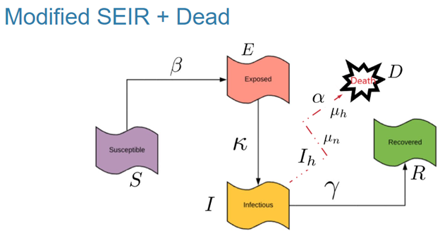
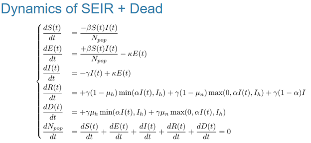

```{r setup, include=FALSE}
knitr::opts_chunk$set(echo = TRUE)
```

## Dynamics of SEIR + Dead

Modeling the dynamics of an epidemiological system using the SEIR (Susceptible-Exposed-Infectious-Recovered) model with an additional compartment for the deceased (SEIRD) is a common approach to study the spread of infectious diseases. The SEIR model is a compartmental model that divides the population into different groups based on their disease status.

The SEIRD model extends the SEIR model by adding a compartment for individuals who have succumbed to the disease. The basic flow of individuals between compartments in the SEIRD model is as follows:

1.  S (Susceptible): Individuals who are not infected but can become exposed to the virus.
2.  E (Exposed): Individuals who have been exposed to the virus but are not yet infectious.
3.  I (Infectious): Individuals who are currently infected and can spread the disease to others.
4.  R (Recovered): Individuals who have recovered from the infection and are assumed to be immune.
5.  D (Dead): Individuals who have died as a result of the disease.

```{r echo=FALSE, out.width=70%, fig.align='center'}

```

The transitions between these compartments are governed by a set of differential equations. Let's denote the respective populations of each compartment by $S(t),E(t),I(t), R(t),D(t)$ at time $t$. The basic SEIRD model equations are:

```{r echo=FALSE, out.width=70%, fig.align='center'}

```

<<<<<<< HEAD
> $\mu_n$ and $\mu_h$ should equal the total unlimited hospital capacity
>
> -   $\mu_h$ hospitalized in ICU
>
> -   $\mu_n$ hospitalized in general ward
>
> $\kappa$ infectious
>
> $\beta$ exposure
>
> $\alpha$ mortality rate – affects **Hospitalized** not **Infected**
>
> $\gamma$ recovery rate
>
> $I_h$ the proportion of the population that can be hospitalized
>
> $$
> I_h = \frac{bed\ capacity}{population\ available}
> $$
>
> $\epsilon$ number of people who can infect
>
> $$
> \epsilon = \frac{infectious\ number}{total\ population}
> $$
>
> **S** number susceptible
>
> $$
> S = 1 - \epsilon
> $$
>
> **N** all the individuals in the SEIR-D model. `Entire population at risk`
>
> $$
> N = S + E + I + D + R
> $$
>
> **P** the entire population $: N \in P$
>
> -   notice that **N** starts at `1` and increases towards **P**
> -   N is initially the first person infected
> -   population of interest
>
> **Time** remains constant

=======
>>>>>>> 721337f (started group work)
## Initial setting

```{r, }
library(deSolve)
library(tidyverse)

SEIR_rk45dp7_Dead <- function(t, state, parameters){
  with(as.list(c(state, parameters)), {
    dS = -beta0 * S * 1/N
    dE = +beta0 * S * 1/N - kappa0*E
    dI = -gamma0 * I + kappa0 * E
    dR = +gamma0 * (1 - muh) * min(alpha0 * I, Ih) + gamma0 * (1 - mun) * max(0,(alpha0 * I) - Ih) + gamma0 * (1 - alpha0)* I
    dD = +gamma0 * muh * min(alpha0 * I, Ih) + gamma0 * mun * max(0, (alpha0 * I) - Ih)
    dN = dS + dE + dI + dR + dD
    dN = 0
    list(c(dS, dE, dI, dR, dD, dN))
  })
}


population <- 10^6
infectious_no <- 3
N <- 1
epsilon = infectious_no/population
Ih <- 1 ### unlimited hospital capacity
mun <- 0.95 ### 0 < mun < 1
muh <- 1- mun
alpha0 <- 0.6
beta0 <- 1.2
kappa0 <- 1.4
gamma0 <-0.3

unit_time <- 70

S <- 1-epsilon
E <- 0
I <- epsilon
R <- 0
D <- 0
step_h <- 0.001

par01 <- list(population = population, infectious_no = infectious_no, N = N, epsilon = epsilon, Ih = Ih, muh = muh, mun = mun, alpha0 = alpha0, beta0 = beta0, kappa0 = kappa0, gamma0 = gamma0, S = S, E = E, I = I, R = R, D = D, step_h = step_h, unit_time = unit_time)

times <- seq(0, par01$unit_time, by = par01$step_h)
state <- c(S = par01$S, E = par01$E, I = par01$I, R = par01$R, D = par01$D, N = par01$N)

parameters <- c(beta0 = par01$beta0, kappa0 = par01$kappa0, gamma0 = par01$gamma0, alpha0 = par01$alpha0)

out <- as.data.frame(ode(y = state, times = times, func = SEIR_rk45dp7_Dead, parms = parameters))
out

# Turn output into long format
library(tidyr)
output_long <- out %>%  pivot_longer(cols = c(S, E, I, R, D),
                        names_to = "state",
                        values_to = "value") 

# Plot number of people in all compartments over time
ggplot(data = output_long,                                               
       aes(x = time, y = value, colour = state, group = state)) +  
  geom_line() +                                                          
  xlab("Time (days)")+                                                   
  ylab("Number of people") +                                
  labs(colour = "Compartment") 
```

<<<<<<< HEAD
Finally we plot the dynamics of Susceptible, Exposed, Infectious and Recovered sub-populations in the same plot.
=======
Finally we plot the dynamics of Susceptibles, Exposed, Infectious and Recovered sub-populations in the same plot.
>>>>>>> 721337f (started group work)

```{r}

# susceptible hosts over time
plot (S ~ time, data = out, type='b', ylim = c(0,1), col = 'blue', ylab = 'S, E, I, R', main = 'SEIRD epidemic') 

# remain on same frame
par (new = TRUE)    
 
# exposed hosts over time
plot (E ~ time, data = out, type='b', ylim = c(0,1), col = 'purple', ylab = '', axes = FALSE) 

# remain on same frame
par (new = TRUE)  

# infectious hosts over time
plot (I ~ time, data = out, type='b', ylim = c(0,1), col = 'red', ylab = '', axes = FALSE) 

# remain on same frame
par (new = TRUE)  

# recovered hosts over time
plot (R ~ time, data = out, type='b', ylim = c(0,1), col = 'green', ylab = '', axes = FALSE)

# remain on same frame
par (new = TRUE)  

# dead hosts over time
plot (D ~ time, data = out, type='b', ylim = c(0,1), col = 'black', ylab = '', axes = FALSE)

```
